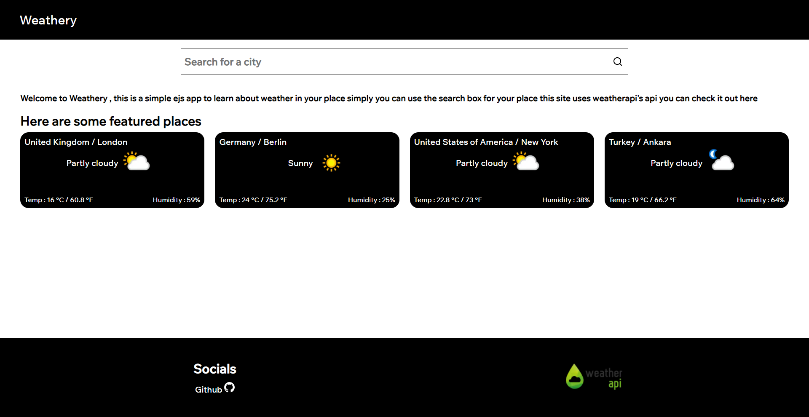
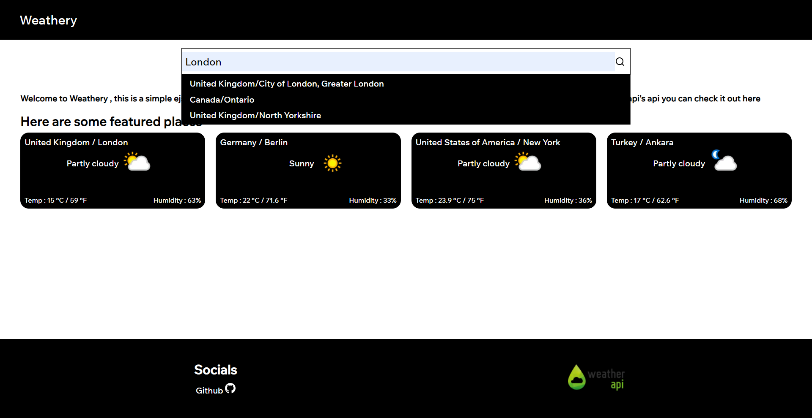
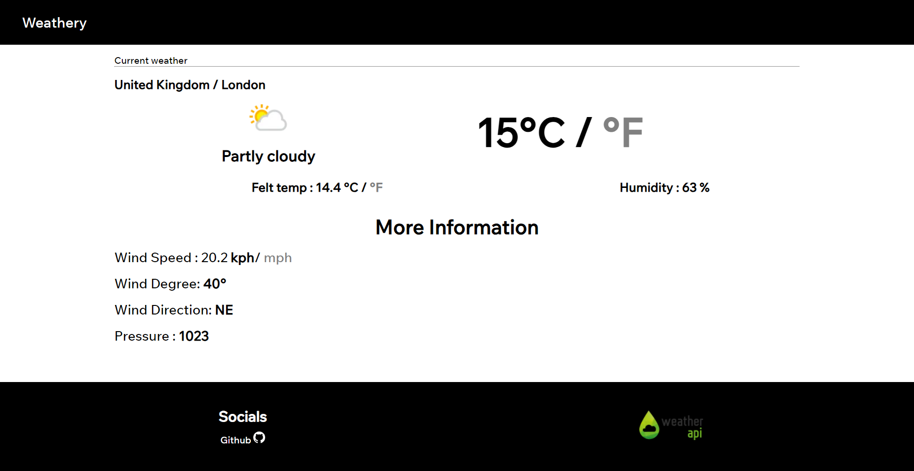
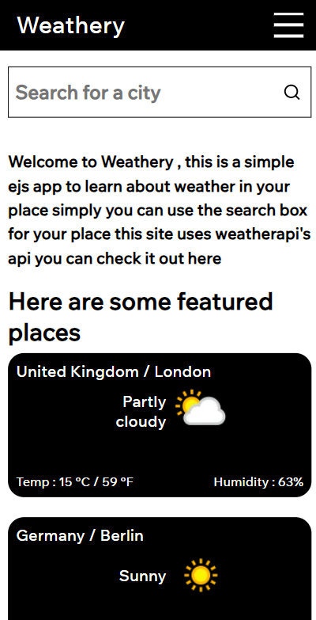
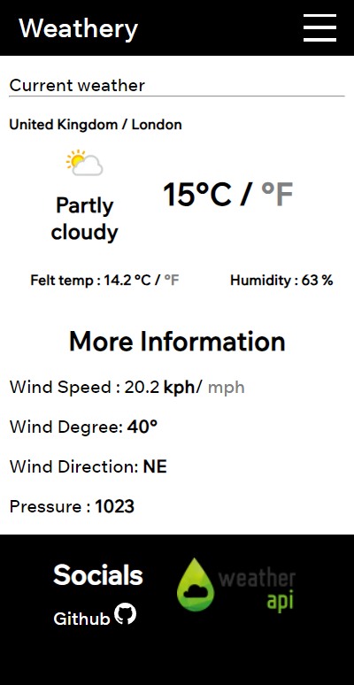

## Getting Started


I prioritized simplicity and lightness in this project , using react could have proved a more interactive site 

First clone the repository and get an api key it's free you can just grab yours from [here](https://www.weatherapi.com/) and you must put your key to .env,then do 


```bash
npm install
# or
yarn add
```

lastly do

```bash
npm run dev
# or
yarn dev
```


Here are some screenshots from the web app.


<div>




</div>

<div>


</div>

Any support would be appreciated,thank you for your interest 

Contact me at contactuncor3@gmail.com
